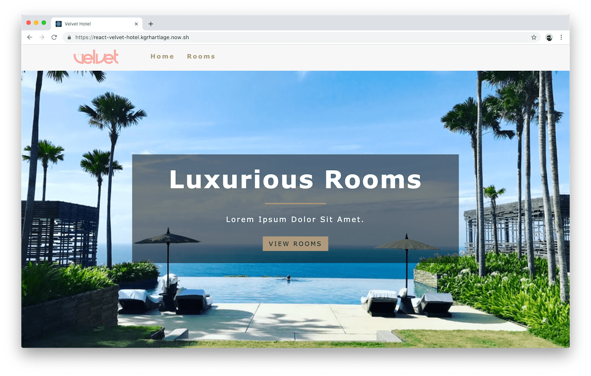

# Velvet Hotel

A website for a luxurious hotel, built with React, React Router, React Context API, styled-components and Contentful.

## Local install

The [Contentful API](https://www.contentful.com/developers/docs/references/content-delivery-api/) requires a personal token that is implemented via a custom environment variable that is not included in this repository. In order to run the app in development mode or deploy a production build on your localhost server, you can clone an [earlier version](https://github.com/kgrhartlage/react-velvet-hotel/tree/434a8a92e1a819dd19723a3278a8836936eaae97) of this project, which is still using data from a local file.

## Preview

## Demo

Try the [live demo](https://react-velvet-hotel.kgrhartlage.now.sh/).

## License

Released under the terms of the [MIT License](https://opensource.org/licenses/MIT).
